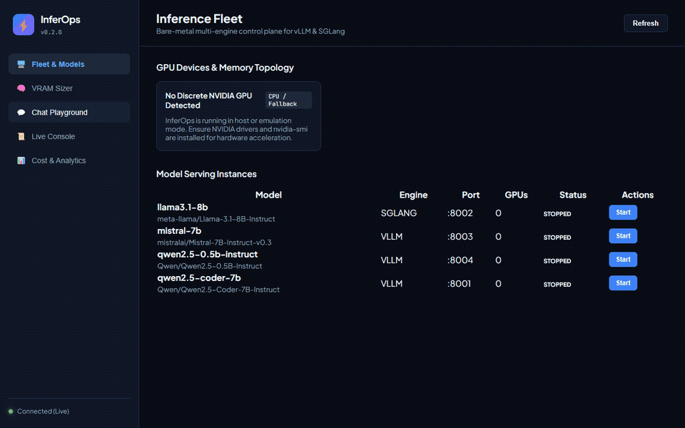
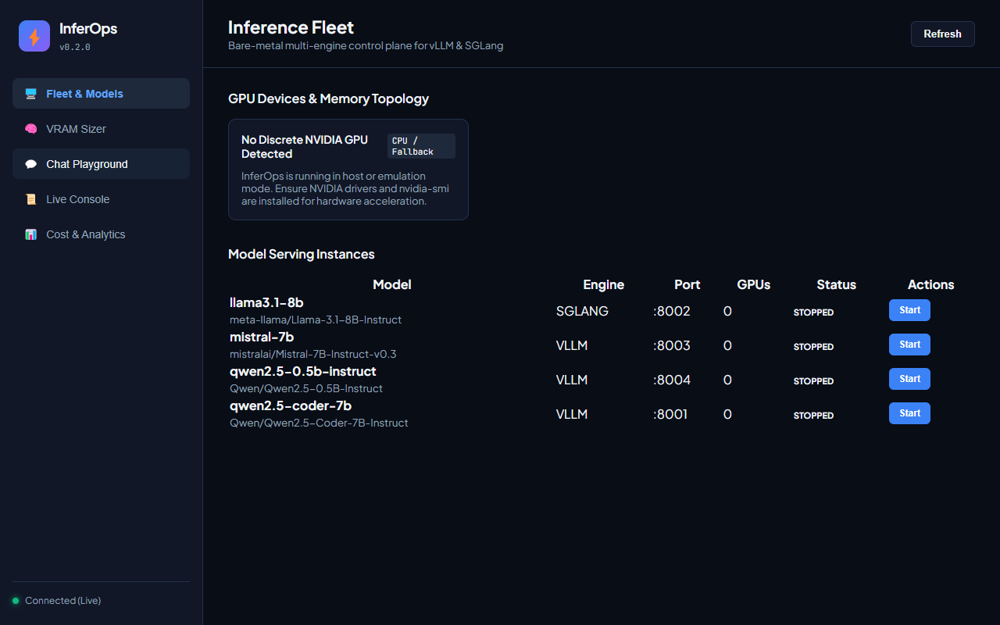
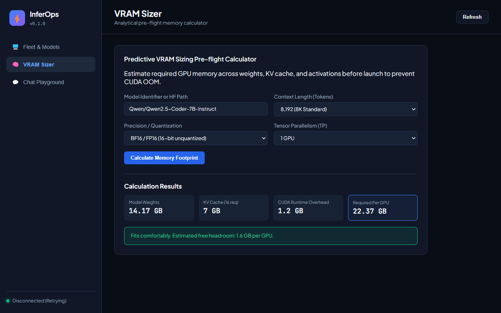
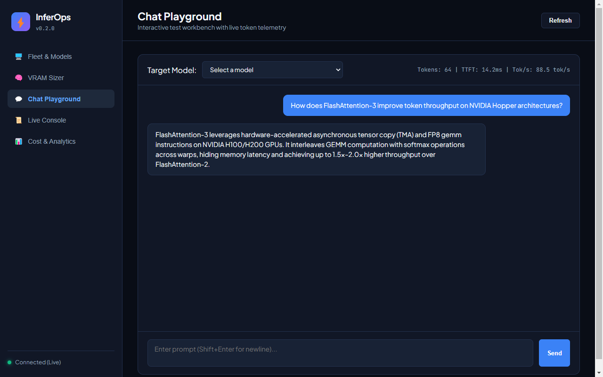
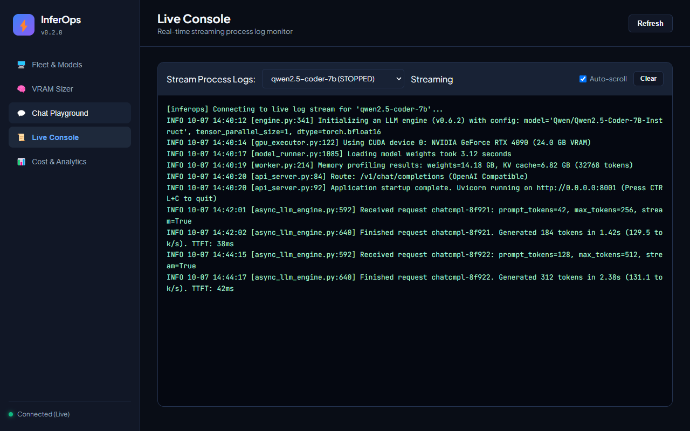
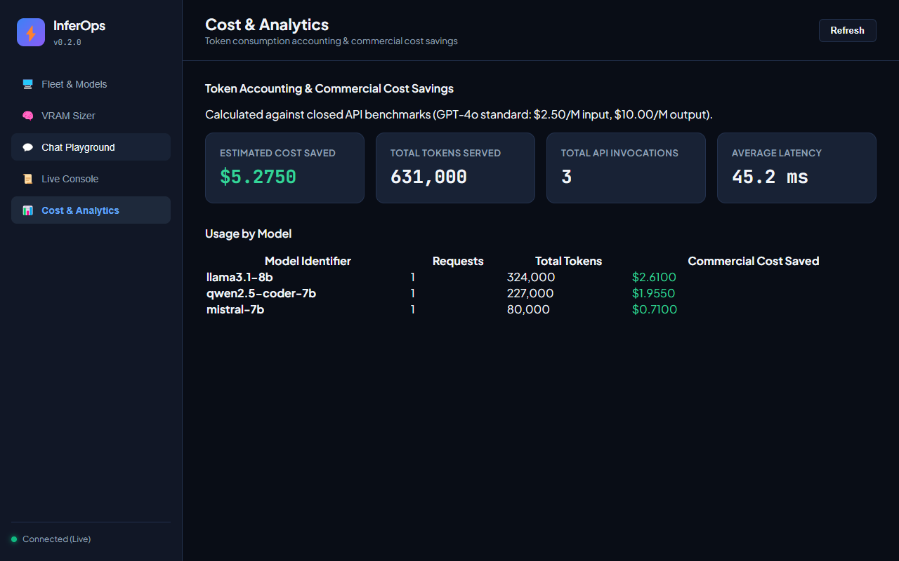

<p align="center">
  
</p>

<h1 align="center">InferOps</h1>

<p align="center">
  <em>Bare-metal control plane and multi-engine supervisor for local LLM inference</em>
</p>

InferOps manages `vLLM` and `SGLang` processes from declarative YAML manifests, calculates VRAM requirements before launching models to prevent out-of-memory errors, exposes an OpenAI-compatible routing gateway, and provides both a terminal interface and a web dashboard with a live chat playground.



```
                           +----------------------+
                           |   configs/*.yaml     |
                           +----------+-----------+
                                      |
                           +----------v-----------+
                           |   InferOps Engine    |
                           |   * Supervisor       |
                           |   * VRAM Pre-check   |
                           |   * Dynamic Router   |
                           +-----+----------+-----+
                                 |          |
                   +-------------v-+      +-v-------------+
                   |  vLLM Engine  |      | SGLang Engine |
                   |  Port 8001    |      | Port 8002     |
                   +---------------+      +---------------+
                                 \          /
                           +------v--------v------+
                           |   OpenAI Gateway     |
                           |   http://:8000/v1    |
                           +----------------------+
```

## Key Capabilities

* **Multi-Engine Support**: Run `vLLM`, `SGLang`, and `llama.cpp` side by side with consistent lifecycle commands (`start`, `stop`, `restart`, `status`, `health`, `logs`).
* **Heterogeneous Hardware**: Auto-detects and isolates NVIDIA CUDA, AMD ROCm (`HIP_VISIBLE_DEVICES`), Apple Silicon unified memory (Metal), and Host CPU execution (`VLLM_TARGET_DEVICE=cpu`).
* **Deep Architecture Support**: Accurate sizing and serving for Dense, MoE (Mixtral 8x7B/8x22B, DeepSeek 671B), DeepSeek MLA (Multi-Head Latent Attention compressed KV cache), Microsoft Phi-4, and Vision-Language Models (VLMs).
* **GGUF & CPU/Metal Offloading**: Full support for quantized GGUF models on consumer laptops, Apple Silicon Mac Studio, and pure CPU servers via `llama.cpp`.
* **Automated Crash Watchdog**: Background healing daemon that auto-revives crashed inference engines with exponential backoff (`inferops watchdog`).
* **Production Observability Stack**: Export production Grafana 10+ dashboards (`inferops export grafana`) and Prometheus scrape configurations (`inferops export prometheus`).
* **Speculative Decoding**: Accelerate large models using draft speculative models configured directly in declarative YAML manifests.
* **HuggingFace Hub Integration**: Pull model architecture directly from HuggingFace to synthesize manifests and run pre-flight VRAM checks (`inferops pull`).
* **Predictive VRAM Sizing**: Calculates weights, GQA/MLA KV cache, and runtime overhead before starting a model to verify that GPU memory is sufficient.
* **Scale-to-Zero & Cold Starts**: Shuts down idle instances after configured inactivity windows, and automatically spins them up on demand when incoming requests arrive.
* **Token & Cost Analytics**: SQLite-backed token accounting tracking throughput, average latency, and commercial cost savings compared to closed cloud APIs (`inferops usage`).
* **API Key Access Control**: Built-in authentication with rate-limiting support (`inferops key create`).
* **Unified Gateway**: OpenAI-compatible reverse proxy at `/v1/chat/completions` and `/v1/models` that dynamically routes requests with server-sent events (SSE) streaming.
* **Automated Tuning**: Evaluates GPU memory to calculate optimal tensor parallelism, sequence length, and KV cache allocation (`inferops tune`).
* **Production DevOps Exporters**: Generates production-ready `docker-compose.yml` with NVIDIA GPU container passthrough and Kubernetes manifests (`inferops export`).
* **Interconnect Topology Diagnostics**: Inspects PCIe and NVLink connectivity to prevent high-latency bottlenecks during tensor parallel operations (`inferops doctor --deep`).
* **Dual Dashboards**: Real-time terminal UI with GPU gauges (`inferops tui`) and browser interface (`inferops web`) with an interactive chat playground, Live Console via WebSockets, and cost analytics.
* **Cross-Platform Supervisor**: Clean process isolation, health checks, log rotation, and graceful shutdown handling across Linux, macOS, WSL2, and Windows.

---

## Interface Preview

### Fleet and Model Management
Live monitoring of active models, runtime ports, health readiness probes, and GPU resource utilization.


### Predictive VRAM Calculator
Calculates parameter weights, KV cache overhead based on context length, and CUDA runtime buffers to prevent crashes before launching inference processes.


### Interactive Chat Playground
Directly test streaming generation and latency on any active model through the integrated web dashboard.


### Live Process Console
Real-time log tailing across engine instances via WebSocket connections directly in the browser.


### Cost & Token Analytics
Token throughput tracking with automatic calculation of commercial cost savings against closed cloud API benchmarks.


---

## Installation

InferOps requires Python 3.10+.

```bash
git clone https://github.com/alexandrmotologa/inferops.git
cd inferops
python -m venv .venv

# On Linux or macOS:
source .venv/bin/activate

# On Windows:
.venv\Scripts\activate

pip install -e ".[dev]"
```

---

## Quick Start

### 1. Initialize a Project Workspace

```bash
inferops init
```

This generates the standard directory structure:
```
.
|-- configs/
|   |-- models/
|   |   `-- qwen2.5-coder-7b.yaml
|   `-- profiles.yaml
|-- runtime/
|   |-- logs/
|   `-- pids/
`-- .env
```

### 2. Verify GPU Memory Capacity

Check whether a target model fits within physical GPU memory before starting:

```bash
inferops vram configs/models/qwen2.5-coder-7b.yaml
```

Output:
```
VRAM Sizing Report: Qwen/Qwen2.5-Coder-7B-Instruct
Weights (FP16):           14.00 GB
KV Cache (32768 ctx):      4.00 GB
Overhead & CUDA Runtime:   1.50 GB
Total Required VRAM:      19.50 GB
GPU Memory Available:     24.00 GB
Status:                   [PASS] Fits with 4.50 GB margin
```

### 3. Generate Tuned Recommendations

Let InferOps analyze GPU memory and recommend optimized parameters:

```bash
inferops tune configs/models/qwen2.5-coder-7b.yaml
```

### 4. Start Models

Start an individual model or an entire profile:

```bash
# Start a single model:
inferops start qwen2.5-coder-7b

# Or start all models in a profile:
inferops start --profile dev
```

### 5. Check Fleet Status

```bash
inferops status
```

### 6. Query the Unified OpenAI Gateway

Start the routing proxy and send chat completion requests:

```bash
# Start proxy in background or standalone:
inferops proxy --port 8000

# Send request:
curl http://localhost:8000/v1/chat/completions \
  -H "Content-Type: application/json" \
  -d '{
    "model": "qwen2.5-coder-7b",
    "messages": [{"role": "user", "content": "Write a quicksort in Python"}]
  }'
```

### 7. Run Synthetic Benchmarks

```bash
inferops benchmark qwen2.5-coder-7b --concurrency 4 --requests 20
```

### 8. Launch the Web Dashboard or Terminal UI

```bash
# Web dashboard:
inferops web --port 8900

# Terminal UI:
inferops tui
```

---

## CLI Reference Summary

| Command | Description |
|---|---|
| `inferops init` | Scaffolds configs, profiles, and runtime directories |
| `inferops pull <repo>` | Fetches HF metadata, creates manifest, and runs VRAM check |
| `inferops doctor [--deep]` | Inspects GPU environment, engine binaries, and interconnect topology |
| `inferops vram <manifest>` | Computes mathematical VRAM requirements |
| `inferops tune <manifest>` | Generates hardware-optimized engine parameters |
| `inferops model list` | Lists all discovered model manifests |
| `inferops model create` | Interactively generates a new model configuration |
| `inferops start <model>` | Launches a model with readiness verification |
| `inferops stop <model>` | Gracefully terminates an inference process |
| `inferops restart <model>` | Restarts a model process |
| `inferops status` | Displays process table, PIDs, ports, and health |
| `inferops logs <model>` | Streams runtime engine logs |
| `inferops benchmark <model>`| Profiles throughput and TTFT under synthetic load |
| `inferops watchdog` | Runs background auto-healing daemon with exponential crash backoff |
| `inferops proxy [--auth]` | Starts the OpenAI-compatible reverse proxy with scale-to-zero |
| `inferops usage` | Displays token consumption accounting and commercial savings |
| `inferops key <create/list>` | Manages cryptographic API keys and rate limits |
| `inferops export <compose/k8s>` | Generates production Docker Compose and Kubernetes manifests |
| `inferops export grafana` | Generates Grafana 10+ dashboard JSON with throughput & VRAM panels |
| `inferops export prometheus` | Generates prometheus.yml scrape configuration |
| `inferops web` | Launches browser dashboard, playground, Live Console, and analytics |
| `inferops tui` | Opens the Textual terminal monitor |

For full CLI documentation, see [docs/cli-reference.md](docs/cli-reference.md).

---

## Architecture

InferOps separates orchestration into decoupled components:

* `src/inferops/core/`: Pydantic schema validation, environment variable interpolation, VRAM estimator, benchmark runner, and the cross-platform process supervisor.
* `src/inferops/engines/`: Engine adapters that translate declarative manifests into exact CLI flags for `vLLM` or `SGLang`.
* `src/inferops/hardware/`: Hardware detection via NVML and metrics aggregation.
* `src/inferops/gateway/`: Dynamic ASGI reverse proxy with SSE streaming and LiteLLM configuration generator.
* `src/inferops/web/`: Embedded FastAPI server with WebSocket telemetry and a dark-mode browser dashboard.
* `src/inferops/tui/`: Textual terminal application for low-overhead server monitoring.

---

## License

InferOps is licensed under the Apache 2.0 License. See [LICENSE](LICENSE) for details.
